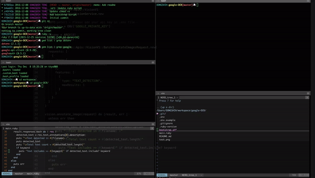

# Simple Google OCR

## Bootstrap

To use the script, please clone or download this repository and run

```shell
$ ./bootstrap.sh
```

if bootstrap.sh is not executable, try `$ sh bootstrap.sh` instead.

You need to add your api key in `.env`

## Usage

Detect text in image file

```
$ ruby main.ruby test.png
```

Check if text include specific keyword

```
$ ruby main.ruby test.png keyword
```



## License

[Beer-Ware License](https://github.com/PeterTeng/GoogleOCR/blob/master/LICENSE.txt)
